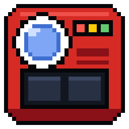
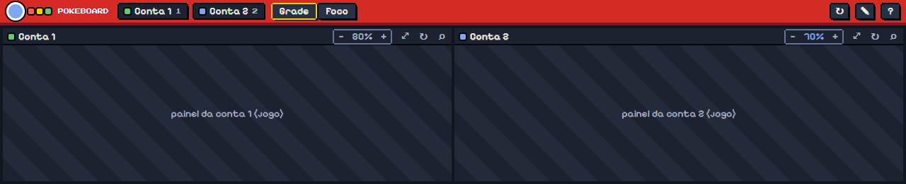
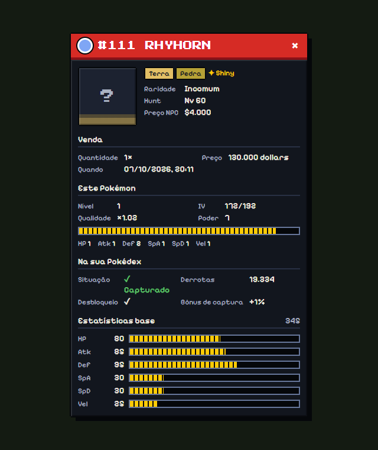

<div align="center">



# PokeBoard

**Várias contas de [Poke Idle World](https://poke.idleworld.online) numa janela só, com visual PokeBoard Retro e ferramentas de visualização.**

[](https://github.com/MatheusTheis/pokeboard/actions/workflows/check.yml)




</div>

---

## O que é

O PokeBoard é um app desktop (Electron) que abre até 4 contas do jogo lado a lado, cada uma com login próprio, e redesenha a interface do jogo no estilo de uma Pokédex dos anos 90. As ações continuam nos botões do próprio jogo: o board muda a aparência, organiza as telas e mostra os dados que o jogo já carregou.

## Destaques

| | |
|---|---|
| **Multicontas** | 2 contas lado a lado (até 4, em grade 2×2), cada painel com sessão e login próprios, salvos entre execuções. `Ctrl+1/2…` amplia uma conta, `Ctrl+0` volta à grade. |
| **Zoom por painel** | Cada painel calcula o zoom para o jogo caber; ajuste fino com `−` `+` ou `Ctrl` + roda do mouse, salvo por conta. |
| **Visual PokeBoard Retro** | Barra de telas no topo inteiro, cartão do jogador, barras segmentadas, chat e as janelas do jogo (Mercado, Pokédex, Breeding, Equipe, Streak, Missões, Perfil, Configurações, lojas de NPC, Daily Kill, Profissões, Rankings, Todos os Shinys, Slot Machine, Inventário, menu da conta) com carcaça vermelha e moldura de pixel. |
| **Barra de telas organizável** | Botão ✎ para reordenar os ícones (vale para todas as contas). No modo dividido, ícones grandes com rolagem pela roda do mouse. |
| **Mercado** | Filtro de moeda (Dollars / Diamonds), Anunciar itens e Pokémon numa tela só, e card com os detalhes ao clicar numa venda do Histórico. No Anunciar, **Vale vender** põe primeiro os itens que rendem mais no Mercado (anúncio mais barato em dollars, menos 3%) do que no Mark, com o ganho total no canto. |
| **Loja do Mark** | Visual Retro nas abas Comprar, Vender e Pokémon, com o dinheiro num visor. No Comprar, **Máx** põe na quantidade o máximo que o dinheiro paga; a compra continua no botão Comprar do jogo. Nas três abas, cada item (ou espécie, no Pokémon) mostra o anúncio mais barato em dollars do Mercado, da última vez que o Mercado foi aberto, em verde quando o Mercado é o melhor negócio: no Comprar, mais barato que o Mark; no Vender e no Pokémon, rendendo mais que o Mark já sem a taxa de 3%. |
| **Mapa** | Filtros próprios (busca, nível, tipos) e posição do mapa que ficam salvos ao fechar e reabrir; marcadores limpos para ver de longe. |
| **Hunt Analyzer** | Abre num lugar livre da tela; "Capturados" abre o log de capturas e "Derrotados" abre a Pokédex do jogo na ficha do Pokémon da hunt. |
| **Log de capturas** | ✨ Shiny, ordenar por IV ou por qualidade, com o IV sempre inteiro na tabela. |
| **Ficha do Pokémon** | Card com tipos, raridade, hunt, evolução, situação na sua Pokédex e estatísticas base. |
| **HUD minimalista** | ▴/▾ no cartão do jogador recolhe o time e deixa só o Pokémon ativo. |
| **Pokédex do jogo** | "Bloqueados" e "Desbloqueados" filtram a grade. Ordem por nível da hunt, com nível e área em cada card; a espécie com mais de uma hunt (Blastoise Nv 80 em Kanto, Brave Blastoise Nv 150 em Outland) aparece uma vez por hunt, e todas abrem a mesma ficha (abates e capturas contam juntos). Botão direito num card: escolher uma hunt da espécie e viajar até ela. Capturou com a Pokédex aberta: ela se atualiza sem fechar. |
| **Pokédex+** | Pokédex com filtros e ordenação (`Alt+P`), usando os sprites que o próprio jogo desenha. |
| **Tema próprio** | `theme/theme.css` é aplicado por cima de tudo e recarrega ao salvar. |

<div align="center">

</div>

## Instalação

Precisa do [Node.js](https://nodejs.org) 20 ou mais novo (Windows 10/11).

```powershell
git clone https://github.com/MatheusTheis/pokeboard.git
cd pokeboard
npm install
npm start
```

Se o PowerShell bloquear o `npm.ps1`, use `npm.cmd install` e `npm.cmd start`.

### Atalho com ícone e barra de tarefas

```powershell
npm run shortcut
```

Cria o atalho **PokeBoard** no Menu Iniciar e na Área de Trabalho, com o ícone do app, rodando o projeto desta pasta (as mudanças no código valem sem reconstruir nada). Para fixar: abra pelo atalho, clique com o botão direito no ícone da barra de tarefas e escolha **Fixar na barra de tarefas**. O atalho e a janela usam o mesmo ID de aplicativo, então o Windows agrupa os dois. Com `npm run shortcut -- --record` o atalho já abre com o gravador ligado.

Na primeira vez, faça login em cada painel com uma conta diferente. O login de cada conta fica salvo: o jogo guarda a sessão só enquanto a janela está aberta, então o PokeBoard guarda uma cópia dela por conta, **criptografada com o seu usuário do Windows**, em `%APPDATA%\poke-board\sessao-contaN.bin`, e a devolve ao abrir. A senha nunca é guardada. Para esquecer um login, saia da conta pelo jogo.

Só abre uma janela do PokeBoard por vez; abrir de novo traz a que já está aberta para a frente.

## Uso

### Atalhos

| Atalho | Ação |
|---|---|
| `Ctrl+1`, `Ctrl+2`… | Amplia uma conta (modo Foco) |
| `Ctrl+0` | Volta à tela dividida |
| `Ctrl` + roda, `Ctrl+=`, `Ctrl+-` | Zoom do painel (5% por vez) |
| `Alt+P` | Abre e fecha a Pokédex+ |
| Duplo clique no nome da conta | Renomeia |

### Visual PokeBoard ou original

O botão **Original**, na barra vermelha ao lado do ↻, mostra o jogo com o design dele: desliga o visual PokeBoard e os controles nossos dentro do jogo (✎, Mercado · Mark, ▴/▾, filtros do mapa e do mercado, Máx da Loja do Mark, extras da Pokédex, ficha). Clique de novo para voltar. A troca é na hora, sem recarregar o jogo, e fica salva. O board (contas, zoom, login), a ordem da barra de telas, o seu `theme.css` e a Pokédex+ continuam.

### Quantas contas

O padrão é 2. Para 1 a 4, troque `accountCount` em `%APPDATA%\poke-board\board.json` e reabra o app.

### Personalizar o visual

Cada painel recebe, nesta ordem: `src/ui/tokens.css`, `src/inject/game-skin.css`, `src/inject/game-windows.css`, a ordem da barra de telas e, por último, `theme/theme.css`. Salvar qualquer CSS reaplica na hora.

1. No cabeçalho de um painel, clique em **⌕** para abrir o DevTools.
2. Use `Ctrl+Shift+C` e clique no elemento do jogo.
3. Escreva a regra em `theme/theme.css` e salve.

Prefira classes com nomes estáveis; classes com hash (`.css-1x2y3z`) mudam quando o jogo atualiza.

## Regras do projeto

O jogo proíbe macros e automação sem autorização; a staff autorizou melhorias visuais e de visualização de dados. Por isso o PokeBoard:

- **não automatiza o jogo:** não clica, não digita e não repete ações pelo jogador. Exceções, sempre a partir de um clique seu e sem nunca comprar, vender ou capturar:
  - o atalho **Mercado · Mark** aperta os botões do próprio jogo na ordem (voltar à cidade, ir ao Shopping, abrir o NPC) quando você escolhe uma das opções;
  - **Derrotados**, no Hunt Analyzer, aperta o botão Pokédex e o card da espécie (só telas de consulta);
  - **Viajar para a hunt**, no botão direito de um card da Pokédex, aperta Mapa, a área e o "Viajar para" da hunt escolhida;
  - **Máx**, na Loja do Mark, preenche o campo de quantidade; quem compra é o botão Comprar do jogo;
- **só lê:** os scripts injetados leem o DOM e as respostas que o jogo já buscou; não chamam rotas de ação;
- **não redistribui arte:** sprites e imagens do jogo são lidos em tempo de execução e guardados só no cache local; nada disso entra neste repositório;
- **não quebra o jogo:** CSS e scripts usam prefixos próprios (`.pr-`, `#pb-`, `pb:`, `--pb-`) e não substituem funções do jogo (o único gancho observa `fetch`/`XMLHttpRequest` e devolve a resposta intacta);
- **no máximo 4 contas.**

## Desenvolvimento

### Estrutura

```
src/main.js                 janela, painéis por conta, layout, zoom, CSS dos painéis, preferências, login salvo
src/preload-shell.js        ponte entre a interface do board e o main
src/preload-game.js         roda em cada painel: login salvo, preferências e injeção dos scripts
src/shell/                  interface do board (barra vermelha e cabeçalhos dos painéis)
src/ui/tokens.css           cores, fontes e medidas do design system (prefixo --pb-)
src/ui/retro.css            componentes .pr-* (botão, lente, LEDs, campo)
src/inject/hook.js          observa (só leitura) as respostas JSON do jogo
src/inject/game-skin.css    layout e visual do HUD, chat, mapa, Pokédex e Hunt Analyzer
src/inject/game-windows.css visual das janelas do jogo, atalhos e card de informação
src/inject/game-layout.js   medidas de layout, céu do Shopping, atalho Mercado · Mark, Derrotados → Pokédex
src/inject/pb-card.js       card de informação (ficha de Pokémon ou item)
src/inject/market-plus.js   filtro de moeda, Anunciar unificado, card do Histórico e Máx da Loja do Mark
src/inject/map-plus.js      filtros e posição salvos no mapa
src/inject/dock-editor.js   ✎ para reordenar a barra de telas
src/inject/hud-plus.js      HUD minimalista
src/inject/capture-log-plus.js  ✨ Shiny / IV↓ / Rar↓ no log de capturas
src/inject/pokedex-plus.js  Pokédex+ e extras da Pokédex do jogo (filtros, ordem por hunt, viajar)
src/recorder.js             gravador de estudo do jogo (PB_RECORD=1)
theme/theme.css             o seu tema, aplicado por último
docs/design-system.md       o design system PokeBoard Retro
scripts/check.js            confere a sintaxe dos .js e as chaves dos .css
scripts/make-icon.js        gera assets/icon.png e assets/icon.ico (pixel art própria)
scripts/make-shortcut.js    cria os atalhos do Menu Iniciar e da Área de Trabalho (npm run shortcut)
assets/                     ícone do app (janela e barra de tarefas)
```

Para redesenhar o ícone, edite a grade em `scripts/make-icon.js` e rode `npx electron scripts/make-icon.js`.

CSS muda na hora ao salvar; scripts de `src/inject/` e o `preload-game.js` entram ao recarregar o painel (↻); o `src/main.js` pede fechar e abrir o app.

### Verificação

```powershell
npm run check
```

Confere a sintaxe de todos os `.js` e as chaves dos `.css` sem abrir o jogo. O mesmo roda no GitHub Actions a cada push.

### Variáveis de ambiente

| Variável | Para quê |
|---|---|
| `PB_DEBUG=1` ou `--pb-debug` | Repete no terminal os avisos e erros do console dos painéis, as navegações e as chamadas de login. |
| `PB_RECORD=1` ou `--pb-record` | Liga o gravador: salva em `%APPDATA%\poke-board\debug\` os endpoints chamados, um exemplo de cada resposta JSON (sem tokens), o mapa do DOM e um print de cada tela nova. Criar `debug\capturar` tira um print na hora. |
| `PB_GAME_URL` | Abre uma página falsa no lugar do jogo, para testar. Use junto com `--user-data-dir` para não mexer nas sessões de verdade. |

```powershell
$env:PB_DEBUG = '1'; $env:PB_RECORD = '1'; npm.cmd start
```

Como testar sem o jogo: suba uma página local com a mesma estrutura de DOM (os mapas gravados pelo `PB_RECORD` ajudam) e rode:

```powershell
$env:PB_GAME_URL = 'http://127.0.0.1:5199/play'; npx electron . --user-data-dir="$env:TEMP\pokeboard-teste"
```

### Design

O visual segue o [design system PokeBoard Retro](docs/design-system.md): carcaça vermelha, tela escura, moldura de pixel e as 18 cores de tipo como dado.

## Aviso

Projeto de fã, sem fins lucrativos e sem vínculo com Poke Idle World, Nintendo, Game Freak, Creatures ou The Pokémon Company. Pokémon e os nomes relacionados são marcas dos seus donos. Nenhuma arte do jogo é distribuída neste repositório.

## Licença

Todos os direitos reservados. O código está público para consulta; uso, cópia ou redistribuição dependem de autorização do autor.
